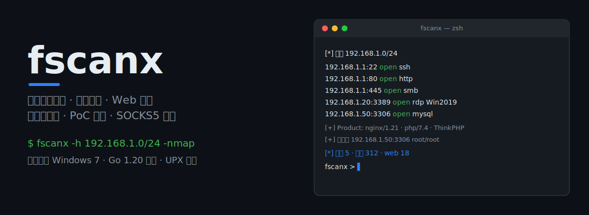
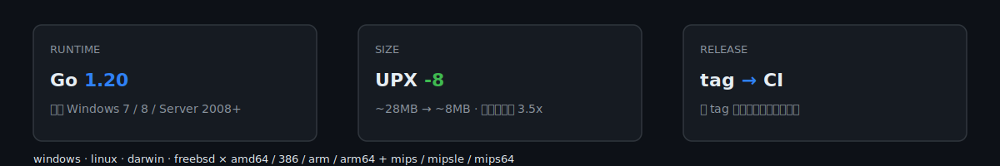
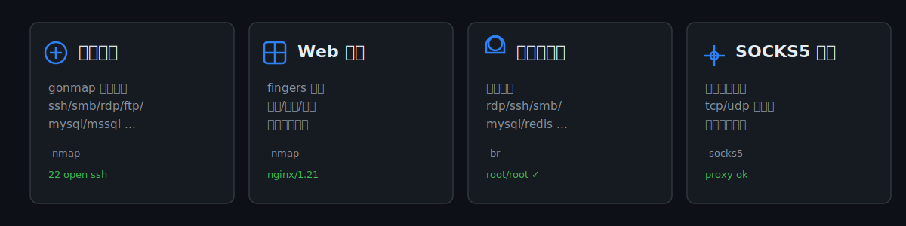

# fscanx

<p align="center">
  
</p>

> 基于 fscan 打磨的内网资产梳理工具：协议识别、Web 指纹、弱口令爆破、PoC 扫描，原生支持 SOCKS5 代理穿透。

<p align="center">
  <a href="https://github.com/gandli/fscanx/actions/workflows/release.yml"></a>
  <a href="https://go.dev"></a>
  <a href="https://www.microsoft.com"></a>
  <a href="https://upx.github.io"></a>
</p>

**本 fork 构建改进**：使用 Go 1.20 编译（兼容 Windows 7），产物经 UPX 压缩，打 tag 即通过 GitHub Actions 自动发布跨平台 Release。

## 快速开始

从 [Releases](https://github.com/gandli/fscanx/releases) 下载对应平台的可执行文件，无需自行编译。

```bash
# 扫描指定网段（智能预扫描存活 C 段）
fscanx -h 192.168.0.0/16 -auto -nmap -t 1000 -np

# 从文件读取目标（ip / ip:port / url / 域名 / cidr，每行一个）
fscanx -hf target.txt -pd -nmap -np

# 通过 SOCKS5 代理扫描目标内网
fscanx -socks5 socks5://127.0.0.1:1080 -h 192.168.1.1/16 -auto
```

## 本 fork 构建与平台

<p align="center">
  
</p>

| 项 | 说明 |
|---|---|
| 工具链 | Go 1.20（最后支持 Windows 7 运行时的版本） |
| 压缩 | UPX `-8` |
| 发布 | 打 `v*` tag 自动触发 `release.yml` 跨平台构建 |
| 平台 | windows / linux / darwin × amd64 / 386 / arm64（含 Win7 32 位） |

> 旧版 Go ≥ 1.21 已将最低 Windows 版本提高到 Win10，故本 fork 锁定 Go 1.20。

## 核心能力

<p align="center">
  
</p>

- **协议识别**：ssh / ftp / smb / rdp / snmp / socks5 / mssql / redis / oracle / mongodb / mysql 等（gonmap 指纹）
- **Web 指纹**：采用 [chainreactors/fingers](https://github.com/chainreactors/fingers) 引擎
- **弱口令爆破**：`-br` 开启（默认关闭）
- **PoC 扫描**：`-poc` 开启（默认关闭）
- **SOCKS5 代理穿透**：支持标准与非标准 socks5，自动规避代理误报
- **大网段智能探测**：`-auto` 先验活子网再深入扫描
- **内存优化**：流式传输 + 布隆过滤器 + 正则预编译，1G VPS 可跑

## 常用场景

```bash
# 1. 大网段快速扫描
fscanx -h 192.168.0.0/16 -auto -nmap -t 1000 -np

# 2. 公网资产信息收集（域名解析到的 C 段一并扫）
fscanx -hf target.txt -pd -nmap -np

# 3. 批量 URL 做 Web 扫描（-tn 控制 Web 并发，默认 60）
fscanx -hf url.txt -tn 200

# 4. 配合 masscan 极速扫描（管道联动）
masscan --rate 200 -p 80,443 192.168.0.0/16 | fscanx -std -nmap -t 200

# 5. 代理模式远程扫描目标内网
fscanx -socks5 socks5://127.0.0.1:1080 -h 192.168.1.1/16 -auto

# 6. 漏洞扫描
fscanx -socks5 socks5://127.0.0.1:1080 -h 192.168.1.1/24 -poc -p 80,443,8080

# 7. 弱口令爆破
fscanx -socks5 socks5://127.0.0.1:1080 -h 192.168.1.1/24 -br -p 21,22,445,3306,6379
fscanx -socks5 socks5://127.0.0.1:1080 -h 192.168.1.1/24 -br -p 445 -user administrator,admin -pwd 123456,admin
```

> 选项说明：`-poc`/`-br` 为开启开关（旧版 `-nopoc`/`-nobr` 已移除）。`-proxy` 设 HTTP 代理，仅作用于 URL 目标，不支持端口扫描。

## 上游高级特性

<details>
<summary>大网段智能探测 · 内存优化 · 指纹库 · 信息收集 · SOCKS5 误报原理（展开）</summary>

### 大网段智能探测

对 A/B 段等大网段，先以「策略」筛选出存活子网段再深入扫描。默认探测每个 C 段的 `1,2,253,254` 四个 IP 位的 80 端口 TCP + ICMP 验活。可用参数微调：

| 参数 | 含义 | 例子 |
|---|---|---|
| `-auto` | 开启智能预扫描 | `-auto` |
| `-am` | 智能阶段探测方法（tcp,icmp） | `-am tcp,icmp` |
| `-ap` | 智能阶段 TCP 端口 | `-ap 22,80` |
| `-ai` | 智能阶段 C 段 IP 位 | `-ai 1,254` |
| `-atime` | 智能阶段 TCP 连接超时（s） | `-atime 2` |

实测 `-h 10 -auto -t 1000`（整个 10.0.0.0/8）智能验活约 15 分钟，内存 ~120MB；B 段仅约 11 秒。

### 内存优化

tcp dialer 配置、http keepalive、gonmap 指纹优选、扫描逻辑流式化、icmp 布隆过滤器、正则预编译、sync.Pool 等。典型场景：`-h 192 -np -t 1000 -p 80` 内存 ~89MB；开启 `-nmap` 稳定 ~154MB。

### 指纹库

- 协议指纹：gonmap，保留 http/https/ssl/smb/rdp/snmp/socks5/mssql/redis/ftp/ssh/ldap/imap/smtp/pop3/oracle/mongodb/mysql 等探针。
- Web 指纹：替换为 [chainreactors/fingers](https://github.com/chainreactors/fingers)。自定义需解压 `mylib/finger/resources/*.json.gz` 编辑后 `gzip -c` 重新打包再 `go build`。

### 增强信息收集（-hf）

支持 ip / ip:port / cidr / cidr:port / url / 纯域名 / masscan 输出，每行一个。新参数 `-pd` 控制是否将 URL、域名解析出的 C 段加入端口扫描。

### SOCKS5 代理误报原理

部分代理（如 clash/v2ray 提供的 socks5）并非标准 socks5 server，会向客户端谎报「连接成功」导致端口全开放误报。fscanx 启动时先探测代理是否标准：非标准时发送 `GET / HTTP/1.0` 探针并读取响应，有回包才判开放，结合 `-nmap` 探针识别真实开放情况，兼容标准与非标准代理。

</details>

## 安全与合规

本工具仅供**授权环境**下的内网资产梳理与安全演练使用。使用者须遵守所在地区法律法规，仅对拥有合法权限的目标进行测试。

## 上游与致谢

本仓库 fork 自 [killmonday/fscanx](https://github.com/killmonday/fscanx)，在其基础上做了 Win7 兼容构建与发布流水线优化。核心扫描能力、指纹引擎、代理穿透等来自上游及 [chainreactors/fingers](https://github.com/chainreactors/fingers) 等项目，致谢原作者。
